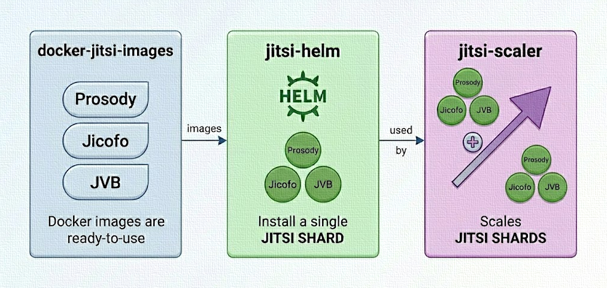

# Jitsi Scaler

A highly-available Helm chart for deploying Jitsi Meet with multi-shard
horizontal scaling. This repository builds upon
[jitsi-helm](https://github.com/jitsi-contrib/jitsi-helm) to provide a
coordinated architecture for large-scale deployments.

## Overview



Standard Jitsi deployments typically operate as a single shard. Jitsi Scaler
enables horizontal growth by:

- Orchestrating multiple independent Jitsi shards within a single release.

- Managing meeting-room stickiness via an integrated HAProxy layer.

- Synchronizing session tables across HAProxy replicas to ensure seamless
  failover and state consistency.

## Key Features

- **Horizontal Sharding**\
  Add or remove shards to support thousands of concurrent participants across
  independent stacks.

- **Room-Based Persistence**\
  Automatically extracts `url_param(room)` to ensure all participants for a
  specific meeting land on the same backend shard.

- **Proxy State Synchronization**\
  HAProxy instances run in a mesh via the peers protocol, preventing session
  loss or "shard hopping" during pod restarts.

## Installation

### Installation using Helm repo

```bash
helm repo add jitsi-scaler https://jitsi-contrib.github.io/jitsi-scaler/
helm install -f myvalues.yaml mycluster jitsi-scaler/jitsi-scaler
```

### Installation using Git repo

```bash
# Clone the repository
git clone https://github.com/jitsi-contrib/jitsi-scaler
cd jitsi-scaler

# Update the jitsi-helm dependency
helm dependency update

# Install
helm install -f myvalues.yaml mycluster .
```

## Configuration

Shards are defined as top-level keys in your `values.yaml`. Use the
`replicaCount` to scale the HAProxy control plane for redundancy.

```yaml
haproxy:
  enabled: true
  replicaCount: 3

# Shard Definitions
shard0:
  enabled: true
shard1:
  enabled: true
```

See also [Sample values files](/docs/samples/)

## Contributing

Contributions are welcome. If you have technical improvements for the HAProxy
logic, shard orchestration, or scaling efficiency, please open an issue or a
pull request.
